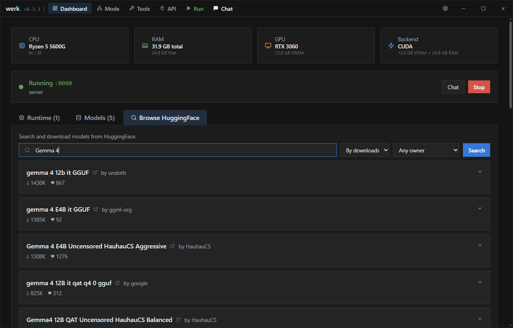
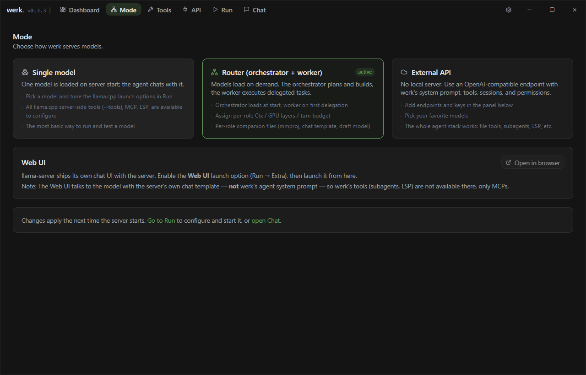
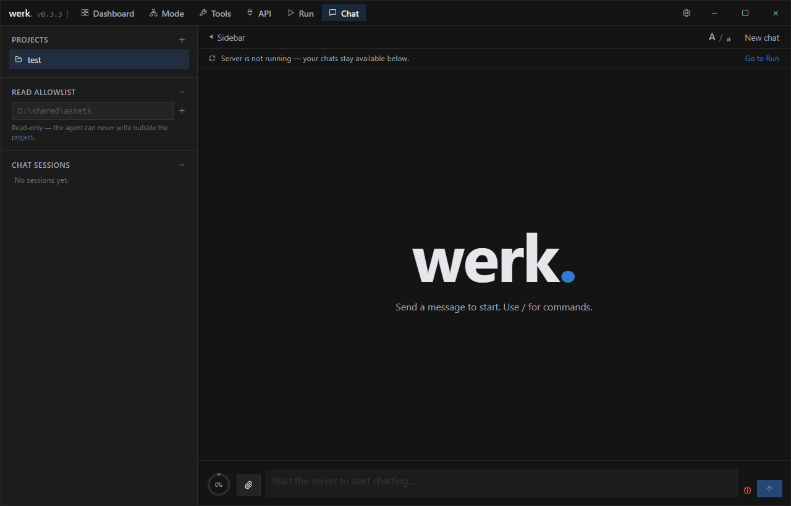
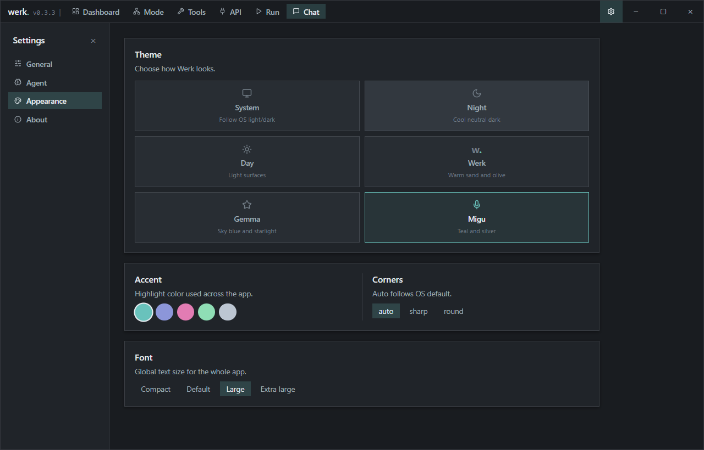

<p align="center"></p>

<p align="center"><i>The werk. harness. It just werks™.</i></p>

<p align="center">
  <a href="https://github.com/otacoo/werk/releases"></a>&nbsp;&nbsp;
  <a href="https://github.com/otacoo/werk/releases"></a>
  <br/>
  
  &nbsp;&nbsp;
</p>

<p align="center"><b>werk. runs your local GGUF models with <a href="https://github.com/ggml-org/llama.cpp">llama.cpp</a> and puts an agentic harness on top — tool-using chat, subagents, MCP servers and language-server diagnostics in one lean desktop app for Windows, macOS and Linux.</b></p>

---

<p align="center">
  
  
</p>
<p align="center">
  
  
</p>

## Status
>[!WARNING]
>Beta software.
>**werk.** is in *active development* and evolving rapidly. Bug reports and ideas are welcome via [issues](https://github.com/otacoo/werk/issues).

## Goals

**werk.** focuses on being easy to use and getting the most out of local models.

- *Easily* run local models
- Add *guardrails* to make small (≤12B) and tiny (≤4B) models actually useful
- Use multiple agents in conjunction with the *orchestrator - worker* pattern
- *Sandbox* everything to the project folder

## Installation

Grab the latest installer for your platform from the [Releases page](https://github.com/otacoo/werk/releases):

- **Windows 10 / 11** — `Werk_x.y.z_x64-setup.exe` or the `.msi` package
- **macOS** — `.dmg` (universal, Intel and Apple silicon)
- **Linux** — `.AppImage` or `.deb`

The app updates itself from GitHub releases, so you only need to install once.\
A **first-run wizard** will walk you through downloading a llama.cpp build, picking (or downloading) models, and choosing a theme.

`Note:` If you're on Windows 10, you will have to install [Microsoft Edge WebView2 runtime](https://developer.microsoft.com/en-us/microsoft-edge/webview2).

## Download

Pre-built binaries for Linux, macOS (Universal), and Windows are available on the [Releases](../../releases) page.

| Platform | Format |
|----------|--------|
| Linux    | AppImage, .deb |
| macOS    | .dmg (Universal: Intel + Apple Silicon) |
| Windows  | .msi, .nsis |


## Building from source

Prerequisites: 
- [Node.js](https://nodejs.org/) 18+
- [Rust](https://www.rust-lang.org/tools/install) (stable).

```bash
# Debian / Ubuntu
sudo apt-get install libwebkit2gtk-4.1-dev libgtk-3-dev libappindicator3-dev librsvg2-dev patchelf
# Arch: 
sudo pacman -S --needed webkit2gtk-4.1 gtk3 librsvg gstreamer gst-plugins-base gst-plugins-good gst-plugins-bad patchelf
# macOS / Windows: 
no extra system dependencies
```

```sh
npm install      # install
npm run dev      # hot-reload desktop window
npm run build    # bundle to src-tauri/target/release/bundle/
```

Tests and checks:

```sh
cargo test --workspace
npm test           # vitest
npm run typecheck  # tsc --noEmit
```

## How it works

**werk.** is a [Tauri 2](https://tauri.app/) desktop app:

- `crates/harness/` — the agent core: model loop, tools, permissions, compaction. Plain Rust, no Tauri and no I/O globals, so it stays testable.
- `src-tauri/` — the drivers: server lifecycle, model scanning, runtimes, downloads, sessions, and the thin Tauri command layer.
- `src/` — the React + TypeScript UI.
- `tools/export-bindings/` — generates the TypeScript bindings from the Rust types, so an IPC mismatch fails at build time.

## Considerations

**werk.** was originally a fork with added elements on top of [pwilkin's](https://github.com/pwilkin/) [Catapult](https://github.com/pwilkin/catapult) after it stopped development.
Since then I've decided to rewrite the backend and frontend elements from scratch, certain elements may still share some visual similarity with Catapult but **werk.** is now much further along from where Catapult was.

## License

Apache License 2.0 — see [LICENSE](LICENSE).\
The third-party components that **werk.** bundles, with their license texts, are listed in [THIRD-PARTY-NOTICES.md](THIRD-PARTY-NOTICES.md).
